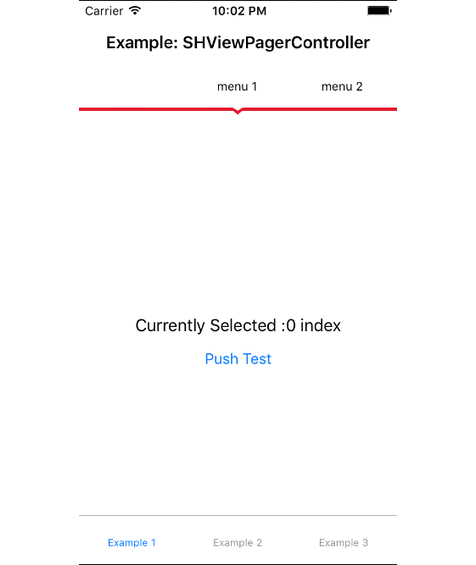
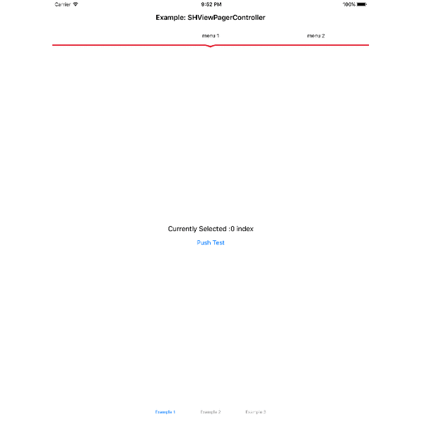

# SHViewPager

[](http://cocoapods.org/pods/SHViewPager)
[](http://cocoapods.org/pods/SHViewPager)
[](http://cocoapods.org/pods/SHViewPager)

- A simple view pager for iOS, which acts similar to android's viewPager. Compatible with iOS 8.0 or later. Supports iPhones and iPads in all interface orientation.

## Table of contents

 * [Preview](#preview)
 * [Advantages](#advantages)
 * [Demo project](#demo-project)
 * [Requirements](#requirements)
 * [Installation](#installation)
    * [Cocoapods](#cocoapods)
    * [Source files](#source-files)
 * [How to use](#how-to-use)
 * [Known Issues](#known-issues)
 * [Using in iOS 7](#using-in-ios-7)
 * [Author](#author)
 * [Contact](#contact)
 * [License](#license)

## Preview

iPhone interface:<br/><br/>
[](Images/SHViewPager_iphoneScreens.gif)
<br/><br/>iPad interface:<br/><br/>
[](Images/SHViewPager_ipadScreens.gif)

## Advantages

 * [x] Supports both Swift and Objective-C
 * [x] Supports all orientations
 * [x] Supports iPad
 * [x] Supports Autolayout

## Demo project

Fully workable examples; both in Objective-C and Swift; are included. If you want to try it yourself, just download/checkout this repository, and run `pod install` from the Example directory first. Then open the `SHViewPager.xcworkspace` with Xcode.

## Requirements

* Xcode 6+
* iOS 8+
* ARC

## Installation

###Cocoapods

*Recommended way*

SHViewPager is available through [CocoaPods](http://cocoapods.org). To install
it, simply add the following line to your Podfile:

```ruby
use_frameworks!
target '<YourTarget>' do
	pod 'SHViewPager', '~> 2.0'
end
```

###Source files

1. Download the [latest code version](http://github.com/shabib87/SHViewPager/archive/master.zip) or add the repository as a git submodule to your git-tracked project.
2. Drag and drop the **Classes** and the **Resources** directory from the archive in your project navigator. Make sure to select *Copy items* when asked if you extracted the code archive outside of your project.

Use SHViewPager wherever you need it with `#import <SHViewPager/SHViewPager.h>` in Objective-C and `import SHViewPager` in Swift.

##How to use

The `SHViewPager` needs it's `datasource` and `delegate` protocols to be implemented. Simply initialize it from code or better: 

**Method 1**

1. Drag and drop an `UIView` from the Storyboard to your `UIViewController`.
2. Change the class to `SHViewPager`, and 
3. Finally connect the `datasource`, `delegate` and your property `IBOutlet`.

**Method 2**

1. Drag and drop an `UIViewController` to the Storyboard.
2. Change the class to `SHViewPagerController`

Four `datasource` methods are required and others are optional.

**Objective-C: The required datasource methods are**

```objc
- (NSInteger)numberOfPagesInViewPager:(SHViewPager *)viewPager;
```

```objc
- (UIViewController *)containerControllerForViewPager:(SHViewPager *)viewPager;
```
```objc
- (UIViewController *)viewPager:(SHViewPager *)viewPager controllerForPageAtIndex:(NSInteger)index;
````

and,


```objc
- (NSString *)viewPager:(SHViewPager *)viewPager titleForPageMenuAtIndex:(NSInteger)index;
````

or,


```objc
- (UIImage *)viewPager:(SHViewPager *)viewPager imageForPageMenuAtIndex:(NSInteger)index;
````

**Swift: The required datasource methods are**

```swift
func numberOfPagesInViewPager(viewPager: SHViewPager) -> Int
```
```swift
func containerControllerForViewPager(viewPager: SHViewPager) -> UIViewController
```
```swift
func viewPager(viewPager: SHViewPager, controllerForPageAtIndex index: Int) -> UIViewController
````

and,


```swift
func viewPager(viewPager: SHViewPager, titleForPageMenuAtIndex index: Int) -> String
````

or,


```swift
func viewPager(viewPager: SHViewPager, imageForPageMenuAtIndex index: Int) -> UIImage
````

To display the contents, you need to call the instance method `reloadData` in your desired method block, typically in `viewDidLoad`.

-Example:

*Objective-C*

```objc
- (void)viewDidLoad {
    [super viewDidLoad];
    // your code
    [viewPager reloadData];
}
```

*Swift*

```objc
override func viewDidLoad() {
    super.viewDidLoad()
    // your code
    pager.reloadData()
}
```

## Known Issues

Please refer to the [open issue list](https://github.com/shabib87/SHViewPager/issues?q=is%3Aopen+is%3Aissue).

## Using in iOS 7

`SHViewPager` version 2.0 does not support iOS 7. If you are willing to use it in iOS 6 and iOS 7, please refer to the [version 1.0](https://github.com/shabib87/SHViewPager/releases/tag/v1.0).

## Author

**Created by** Ahmad Shabibul Hossain, [@shabib_hossain](https://twitter.com/shabib_hossain) on 5/15/14.

## Contact

Share feedbacks and ideas to improve this project, I would love to hear them out. I would also greatly appreciate if you follow me on [Twitter at @shabib_hossain](https://twitter.com/shabib_hossain).

## License

SHViewPager is available under the MIT license. See the LICENSE file for more info.
